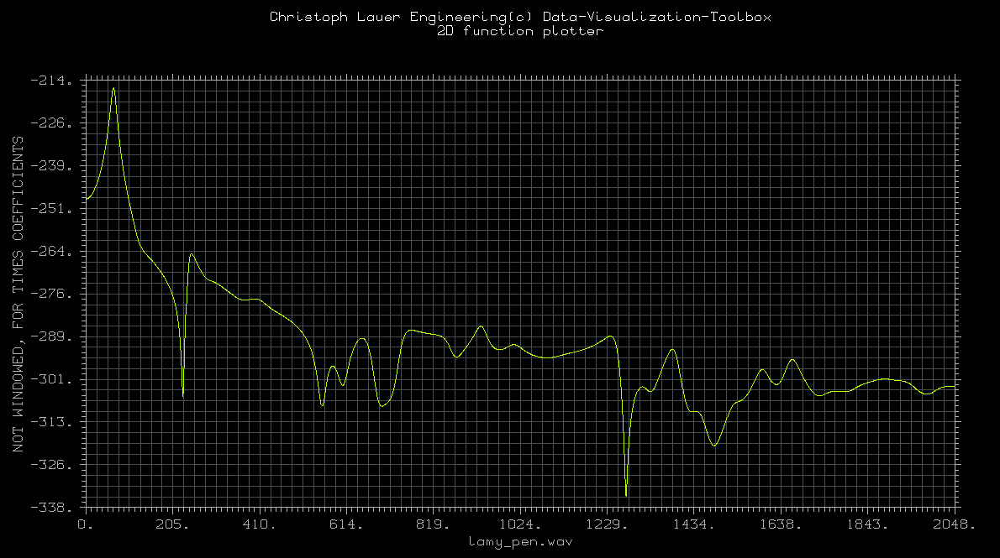
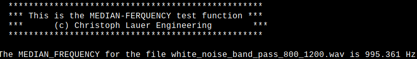

# DSP-Algorithm-Library
A C++ library of not so common signal processing algorithms. The library is programmed in platform independent ANSI C++ and can be used directly from source code. I use the [DISLIN](https://www.dislin.de) library for the visualization of the 1d and 2d data, generated in the test routines for each single algorithm. DISLIN is a scientific plotting software developed at the Max Planck Institute for Solar System Research for displaying data as curves, surfaces, 3-D color plots, bar graphs, pie charts, contours and maps. In order to run all the test routines for the algorithms, you have first make sure that DISLIN is installed properly for your operating system. I have compiled all algorithms on the Raspberry Pi and prepared all test routines including DISLIN for this platform. But you can simply take the algorithms from the source code you are interested in, without the use of DISLIN. If DISLIN is available for the Apple ARM64 M architecture, I will recompile all test routines for MacOS ARM64 platform. The test routines are separated from the algorithms, and if you are only interested in a single algorithm, you can simply copy your algorithm source code files. Each folder contains the encapsulated algorithm class files and a usage example in the test.cpp file. A simple make file can be used to build the algorithm test environment on any platform. Please note that all the algorithms here are in the clauer::math namespace resp. clauer::io. All functions and classes are written with the same coding conventions for the class/function/variable names, and the formatting rules defined in the clauer coding styles for c++. Most of the header files have a rich documentation with an explanation of the algorithm, so please have always a look into the header files for the corresponding algorithm. I developed this allgorithms in 2005, for an europan union founded research project and have the permission to publish them here. The library is mostly used in digital audio. **Please note that I cannot guarantee the correctness of the algorithms, and some minor algorithms are not yet fully developed.**

## Data Plotter
The class collects all the useful function for the plotting of data structures into image files, on the screen and onto the printer. Therefor we use the dislin programming library from the Max Planck Institute for Solar System Research in Lindau/Karlsruhe and would linke to say thanks to the **author Helmut Michels**. This class provides the caller with functions for the plotting of one and more dimensional functions and plots onto images, the screen and the printer.


 
## Wave File Handler
This template class supports the caller with a basic interface to extract and write samples from MS wave format files. The easiest way to extract samples is the **autoReadWaveFile** function. Note that all reading vectors are generated inside the reading function and must be deleted outside the function explicitly. Note that the error handling is accumulative, which means that the error flag can bi given to more than one function, and it will only set to true if an error occurs.
 
## Cepstrum
Like most of the mathematical classes this class also has only static members so no explicite instanciation is necessary. The cepstrum class implement like the name says, the  cepstral analysis methods. This function calcualtes the cepstrum for the given time domain signal. The real cepstrum will be calculated corresponding folowing formular: Cepstrum = ABS ( IFFT ( LOG ( ABS ( FFT ( x) ) ) ). Note that the resulting cepstrum will be calculated via an zero-padded fast-fourier-transformation, which has in the back-transformation a symetry and therefore the resulting cepstrum will be have at the end an zero zone.

  
## Cohen Class Distributions

### Smoothed Pseudo Wigner Ville Distribution
This function implements the algorithm for the calculation of a "Discrete Smoothed Pseudo Wigner-Ville-Distribution" for the given double vector input signal. The function calculates the PWVT corresponding to the equation:

```
            /        /                                  -j2pi f tau`
SPWV(t,f) = | h(tau) | g(tau-t) x(mu+tau/2)x*(mu-tau/2)e          dmu dtau`
            /        /`
```

To prevent aliasing, the real input signal must be band limited with the nyquist frequency SR/2. The discrete wigner ville distribution has a band limitation of SR/4, so normally for complex signals the input time domain vector must be up-sampled to the double length. In our case we have a real input signal, so we use the complex transformation with the analytic signal as input which prevents aliasing at the frequency SR/4 and the mirroring of the image. For this case, we can switch between the transformation with the analytic signal and the real input signal. The upsampling method only required for complex input signals, which is not part of our implementation.


### Pseudo Margenau Hill Distribution
See the description of the Smoothed Pseudo Wigner Ville Distribution which is also valid for this cohen class distribution apart from the formula.

 
### Choi Williams Distribution
See the description of the Smoothed Pseudo Wigner Ville Distribution which is also valid for this cohen class distribution apart from the formula.


### Zaho Atlas Marks Distribution
See the description of the Smoothed Pseudo Wigner Ville Distribution which is also valid for this cohen class distribution apart from the formula.


## Convolution
This class collects functions for the calculation of the convolution. One static function is for  the "normal" convolution calculation, corresponding to the well known convolution equation in the time domain. Another function calculates the so-called fast convolution in the frequency domain with help of the FFT. Like all other mathematic functions and classes, both functions are implemented as static functions, so no instantiation of the class is necessary. 


## Correlation
This class file defines the discrete cross-correlation and autocorrelation functions. Like most of the math classes, this functions are defined as static class functions, so no instantiation is needed. This very short algorithm is defined directly into the header file of the class definition as template implementations. As defined in the clauer coding styles, this class template header file has the suffix HPP instead of H for class files. NOTE: There are much more-faster implementations available, e.G. the FFT Autocorrelation which is also implemented here. This algorithm is not tested properly, so I cannot totally guaranty the correctness of the algorithm.


## Damping Constant
This class collects functions to find a suitable exponential expression for an exponential function which matches best the envelope of a given impulse response from a resonance analysis. The class implements only two functions, the main function which steers everything, and the exponential regression function which try to find a suitable exponential function. This function makes heavily use of the envelope function class-collection which was defined outside of this class file. The main function is implemented to find the damping constant autonomously and try to match the best values. The higher the damping constant, the faster signal converges to the zero line => Higher Damping. The function try to match the best physical units and the result should return a value with unit 1/s which can be guaranteed by the sampling rate. Another core function of this class-collection is the exponential regression, which here implemented with a fallback to a linear regression where the solution can found in every statistical book. The exponential regression returns the amplitude and damping factor of the function ```f(t)=A*exp(-bt)```, where b is the damping factor and the amplitude A can be ignored.


## Digital Filter
This class collects a set of useful digital filter functions, which are available for the four base types of digital filters (CriticalDamping, Bessel, Butterwirth and Tschebyscheff) implemnted with a low pass, a high pass, a band-pass and a bandstop filter. The filter coefficients defined into this class are predefined for the IIR filter. Higher filter orders are realized with multiple biquad filters in concatenation. A digital biquad filter is a second-order recursive linear filter, containing two poles and two zeros. "Biquad" is an abbreviation of "biquadratic", which refers to the fact that in the Z domain, its transfer function is the ratio of two quadratic functions. 

 
## Envelope
This class implements a envelope calculation based on the Hilbert transformation. More details about the implementation can be found into the function descriptions. The Hilbert transform works best with AC coupled, band-limited signals. To perform an inverse Hilbert Transformation can be computed with the aid of the Hilbert Transformation and post negation. Because our implementation is based on the FFT we can say that the performance of the Hilbert Transformation is blindingly fast. The complexity speed should be a little bit more than the 2*FFT time --> approximately 2*N*log(N)+rest for lengths from a power of two. This implementation takes every length of input vectors and does not depend on lengths from a power of two. Because we implemented this algorithms by  hand this collection of the Hilbert and the envelope calculation benefits heavily from the compiler optimizations, so we advise for performance purposes to compile this code with the compiler optimization "-O3", because we are not sure to make the best performant implementation here.


## Fourier Transformation
This file contains the "KING OF THE ALGORITHMS", a few FFT routines, including a real-FFT routine that is almost twice as fast as a normal complex FFT, and a power spectrum routine when you know you don't care about phase information. The basic algorithm for his code was based on Numerical Recipes in FORTRAN. I optimized his code further by reducing array accesses, caching the bit reversal table, and eliminating float-to-double conversions, and I added the routines to calculate a real FFT and a real power spectrum. Note that all this functions need an output data array pre  allocation ! This implementation can massively make sense of the compiler optimization, so the  compiler should be called with the "-O3" option to increase the speed performance. We implement  here mostly the standard algorithm, which goes back to the work of L.W. Cooley and J.W. Turkey in the mid-1960s. For performance reasons we put the algorithm in each own of the tree implementations (Complex, Real, and Power) and do  not make use of some outsourced function. This should give us the fastest implementation. Please note that all the algorithms here work only with a vector length from a power of two. The class collection was extended by a discrete Fourier transformation (DFT) also, which has the same signature as the FFT and can be used to compute transformations with a length which is not a power of two.


## Harmonic Analyze 
This class implements functions for the harmonic analyze. Like all other mathematical classes, this class collects static functions. The harmonic analyze function tries to find a fundamental frequency in a given search interval and extracts the levels of the harmonic followers. The resulting return values are all in decibel (dB) level dimensions, apart from the frequency return values.


## Harmonic Base Frequency Finder
Not fully implented so far.

## Impulse Response Extraction 
This class supports a collection of useful functions for the impulse response extraction with the sine sweep technique. Like all the other mathematical functions, this class has only static function members. If the sweep response is recorded, a deconvolution function be called for extraction of either the transfer function of the impulse response of the system. This function generates an exponential sweep sine signal with the desired max amplitude. A special flag can be used to extract a linear sweeped signal. For a core sine signal without the sweep, set the start and end frequency to the same value.


## Jitter Analysis
The definition of the Jitter in this case is not like the Jitter definition in digital audio. We understood Jitter as a micro oscillation of the frequency peak in a band, which can be used to detect variation in some transmission gears or other static signals with fluctuations in the long time analysis. This static function extracts the frequency peak Jitter for a given frequency band from a time domain based signal. The result is the frequency peak Jitter in Hz. This implementation here uses no kind of which craft ;-) it a simple and easy implementation which uses the Linear Predictive Coding to calculate the spectrum. By default, this function returns the Jitter in Hz from window to window. Instead, to see the difference it is possible to track the peak value.


## Linear Predictive Coding
The objective of linear prediction is to form a model of a linear time-invariant digital system thought observation of input and output sequences. The implementation of the prediction coefficient extraction here serves after the Levinson Durbin implementation to solve the matrix system. Please Note: The number of LPC Coefficients used to predict the future vector must be shorter than the number of previous samples used to extract the LP Coefficients !!! An Assertion in the code will check this. In release versions, the usage of more LP-Coefficients as the previous samples will cause an access violation !!!


## Median Frequency
This class implements two static member functions for the calculation of the median frequency for either a time domain or a frequency domain input signal. The median frequency is the frequency where the integral on the left side is equal to the integral of the Right side. This function calculates the median frequency of a spectrum. The median frequency is the frequency in the spectrum where the integral on the right side is equal to the integral on the left side. This function can be used for example to make a decision for the high of a signal or try to differ between a high and a low frequency distributed signal.


## Normalization
This static function normalizes all amplitudes of the given vector to the peak given as funtion parameter. The values are trimmed in a way that the no value reaches the highest point an all other values are scalled corresponding the peak value.

## Polygonal Chain
This class implements a static function for the calculation of the polygonal chain for the given input signal. The function is implemented as a static template class. The polygonal chain is the integrated way of the signal. For a more detailed information, the normalized polygonal chain for the signal should be taken. The normalized polygonal chain is the polygonal chain of the signal divided to the length of the signal. This static function calculates the signal polygonal chain way of the given signal. The polygonal chain way is simple, the length of the way of the signal.

## Sample rate Converter
This class is a simple c++ wrapper to the sample rate converter c function collection defined into the sample_rate_converter files. The functions offer a sample rate conversion with three different methods. The SRC_LINEAR and the SRC_ZERO_ORDER_HOLD methods are really fast but so bad in the results that the usage of the SRC_SINC_FASTEST should be the best solution in the most cases...

## Short Time Fourier Transformation
This class implements only one static function for the extraction of the so-called spectrogram, aka the sonogram or power spectrum of the short time Fourier transformation. The function allocates a two-dimensional array for itself and try to work as autonomous as possible. The resulting array can be accessed with spectrogram[time][frequency].

 
## Smooth
Smoothing algorithms. See the corresponding header files for more details.

## Tools
Essentialy a test signal generator.

## Wavelet Packet Decomposition
This class implements an dynamic tree wavelet package transformation for multiple wavelet types and ranges. Wavelet filter banks for Daubechies, Symmlets, Coiflets, Beylkin, Pollen and Vaidyanathan wavelet types are predefined. All the functions in this class are implemented static so no instanciation of the a class member is needed. Corresponding to the wavelet theory, in the scaling function the low pass filter bank and the wavelet function itself is the high pass decomposition. In out case the wavelet function can be computed with the permutation function. In the classical multiresolution wavelet pyramid algorithm, only the low pass (the scling function) will be used for the octave splitting, but in the wavelet packet decomposition the splitting-tree can be pre-defined and in this wav the energy bands for the leaf nodes center frequencies can be controlled while changing the decomposition tree. The energy of the band will be computed with classical littlewood-stein-paley theorem. The band energies will be stored in the leaf nodes called in out case the segementDescriptions. The center frequencies for each band will be calculated while the packet decomposition. Appart from the wavelet packet decomposition a standart wavelet transfromation is implemented. We have pre calcualted a huge ammount of wavelet filter banks reaching from the DAUBECHIES over the SYMLET to the COIFMAN, BEYLKIN, POLLEN and VAIDYANATHAN wavle filter banks. NOTE: please note that this algorithm in one of the complexest algorithms in the whole algorithm collection, so the caller/user should have a basic idea about how the algorithm works when he want to use them. No guarantee for the correctness of the algorithm.


## Wavelet Transformation
This class file defines an wavelet transformation implemented with the pyramid multiresolution algorithmus. As most of the mathicatical classes the functions here are all defined as static functions so no instantiation is necessary.
 
## Zero Crossing Rate
This class implements a staic function for the calculation of the zero crossing rate for a given signal.

## Math Utilities
Useful function for example de/logarithmization...
